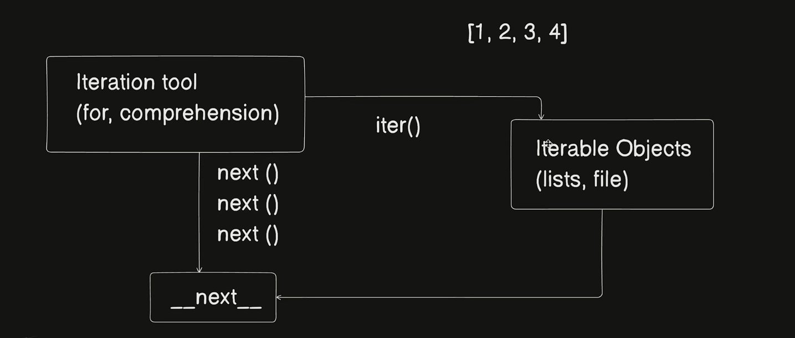

# **Internal Working of Iteration in Python**

In Python, iteration is a fundamental concept that allows us to traverse through iterable objects like lists, tuples, dictionaries, and files. The internal working of iteration follows a specific sequence of steps involving **iterable objects, iterators, and iteration tools**.

## **1. Iterable Objects**
An **iterable** is any Python object that can return an iterator, typically using the `iter()` function. Examples include:
- Lists (`[1, 2, 3, 4]`)
- Tuples
- Strings
- Files
- Sets and Dictionaries


## **2. Converting an Iterable to an Iterator**
An **iterator** is an object that follows the **iterator protocol**, meaning it has:
- A `__iter__()` method that returns the iterator itself.
- A `__next__()` method that returns the next item from the sequence.

To get an iterator from an iterable:
```python
my_list = [1, 2, 3, 4]
iterator = iter(my_list)  # Calling iter() on the iterable
```

## **3. Using `next()` to Fetch Elements**
Once we have an iterator, we can use the built-in `next()` function to retrieve elements sequentially.
```python
print(next(iterator))  # 1
print(next(iterator))  # 2
print(next(iterator))  # 3
print(next(iterator))  # 4
```
If we call `next()` after exhausting all elements, a `StopIteration` exception is raised.

## **4. Iteration Tools**
There are two primary ways to iterate in Python:
1. **Explicit Iteration** using `next()`:
   ```python
   my_list = [1, 2, 3, 4]
   iterator = iter(my_list)

   while True:
       try:
           print(next(iterator))
       except StopIteration:
           break  # Stop when iteration ends
   ```

2. **Implicit Iteration** using loops (`for`, comprehensions):
   ```python
   for item in my_list:
       print(item)
   ```
   - The `for` loop internally calls `iter()` to get an iterator.
   - It repeatedly calls `next()` until a `StopIteration` exception occurs.

## **5. Under the Hood: How `for` Loop Works**
A `for` loop is just syntactic sugar for:
```python
iterable = [1, 2, 3, 4]
iterator = iter(iterable)  # Calls iter() to get an iterator

while True:
    try:
        item = next(iterator)  # Calls next()
        print(item)
    except StopIteration:
        break  # Ends loop when exhausted
```

## **6. Internal Working Diagram**
Below is a visual representation of how iteration works internally:

![Iteration Internal Working]


- **Iterable Objects** (e.g., lists, files) can be converted into an **Iterator** using `iter()`.
- The **Iteration Tool** (like `for` loops and comprehensions) repeatedly calls `next()` on the iterator.
- The `__next__()` method is invoked until the sequence is exhausted.

---

# **Introduction**
Iteration is a fundamental concept in Python that allows traversing through sequences such as lists, tuples, dictionaries, files, and more. Python provides various built-in iteration tools like for loops, while loops, iterators, and generators.

This document explains the internal working of iteration, using examples and shell outputs.

## **Reading a File Iteratively**

### **Method 1: Using readline()**
The `readline()` method reads one line at a time from the file.

```python
f = open('script.py')

print(f.readline())  # Reads the first line
print(f.readline())  # Reads the second line
```

#### **Shell Output**
```shell
>>> f = open('script.py')
>>> f.readline()
'import time\n'
>>> f.readline()
'\n'
>>> f.readline()
'print("Hey developers! Let\'s learn about iteration tools in Python.")\n'
```

Each call to `readline()` reads the next line until there are no more lines left. After reading the last line, calling `readline()` again returns an empty string `''`.

### **Method 2: Using the `__next__()` Method**
Python files are iterable objects, meaning they support the iterator protocol.

```python
f = open('script.py')

print(f.__next__())  # Reads the first line
print(f.__next__())  # Reads the second line
```

#### **Shell Output**
```shell
>>> f = open('script.py') 
>>> f.__next__()
'import time\n'
>>> f.__next__()
'\n'
>>> f.__next__()
'print("Hey developers! Let\'s learn about iteration tools in Python.")\n'
>>> f.__next__()
Traceback (most recent call last):
  File "<stdin>", line 1, in <module>
StopIteration
```

### **Method 3: Using a for Loop**
A `for` loop is the most Pythonic way to iterate over a file.

```python
for line in open('script.py'):
    print(line, end='')
```

### **Method 4: Using a while Loop**
```python
f = open('script.py')

while True:
    line = f.readline()
    if not line:
        break
    print(line, end='')
```

## **Iterators in Python**
An iterator is an object that implements two special methods:
- `__iter__()` → Returns the iterator object itself.
- `__next__()` → Returns the next element in the sequence and raises `StopIteration` when exhausted.

### **Creating an Iterator from a List**
```python
myList = [1, 2, 3, 4]
I = iter(myList)

print(next(I))  # 1
print(next(I))  # 2
print(next(I))  # 3
print(next(I))  # 4
```

### **Checking If an Object is an Iterator**
```python
f = open('script.py')
print(iter(f) is f)  # True
```

Lists, however, are not iterators.
```python
myNewList = [1, 2, 3]
print(iter(myNewList) is myNewList)  # False
```

## **Iteration with Dictionaries**
Dictionaries support iteration over their keys.

```python
D = {'a': 1, 'b': 2}
I = iter(D)

print(next(I))  # 'a'
print(next(I))  # 'b'
```

## **Iterating Over range()**
The `range()` function is iterable but not an iterator. We need to convert it into an iterator.

```python
R = range(5)
I = iter(R)

print(next(I))  # 0
print(next(I))  # 1
print(next(I))  # 2
print(next(I))  # 3
print(next(I))  # 4
```

